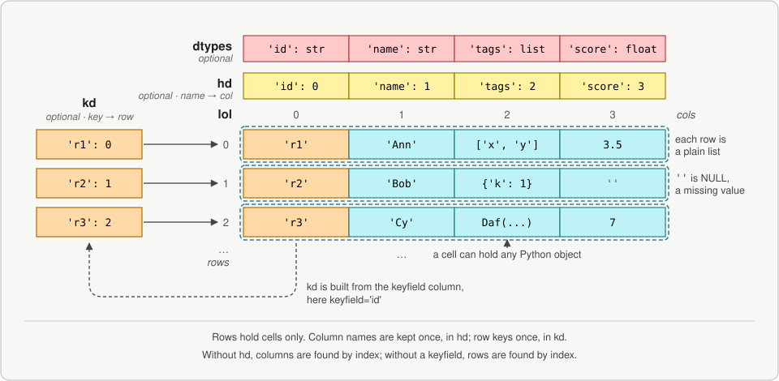

# Daffodil

Daffodil gives Python fast, lightweight 2-D data tables. A table is a list of rows, and each
row is a plain Python list. Use it where data arrives and is processed row by row: reading
files, building records, cleaning, reshaping, and writing them out again.



## Install

```bash
pip install daffodil
```

Python 3.10 or later. Daffodil is pure Python. pandas and NumPy are needed only to convert
to and from them.

## Quick start

```python
from daffodil.daf import Daf

d = Daf(cols=['id', 'item', 'qty'], keyfield='id')
d.append({'id': 'a1', 'item': 'pen', 'qty': 3})
d.append(['b2', 'ink', 10])

d.select_record('b2')        # {'id': 'b2', 'item': 'ink', 'qty': 10}
d.col('qty')                 # [3, 10]
d.select_where(lambda row: row['qty'] > 5)
print(d)                     # a Markdown table
```

The [Guide](guide/getting-started.md) starts from here.

## The data model

The rows are kept in `lol`, a list of lists. A row holds only its cells. The column names are
kept once, in the header dict `hd`, which maps each name to its column number. A table can
have a keyfield. Then the key dict `kd` maps each key to its row number, so a lookup by key
is one dict access.

A cell can hold any Python object: text, a number, a list, a dict, or even another Daf. There
is no conversion on the way in or out. The data stays the Python objects you put there.

## Why not pandas?

pandas stores a table as columns, in NumPy arrays. That is right for heavy numeric work on
columns. It is costly for data that is built and used as rows.

**pandas has no cheap way to add a row.** pandas removed `DataFrame.append()` in version 2.0.
What is left copies or reallocates the frame on each row. Adding 5,000 rows one at a time
took 2.4 s with `pd.concat()`. So the usual pattern is to collect the rows in a list of
dicts, then convert it all at once with `pd.DataFrame()`. Daffodil needs no conversion step.
Collect the rows in a list and wrap it, or append each row to the Daf.

The table below builds 1,000 rows of 1,000 columns: one string column and 999 int columns.
This is the shape of the older benchmarks. The ints run from 0 to 1,000,002, so each one is
its own Python object, as in most real data.

| How the table is built | Build | Convert | Total | Peak memory | Kept memory |
|---|--:|--:|--:|--:|--:|
| pandas: append a dict per row, then `pd.DataFrame()` | 223 ms | 320 ms | 543 ms | 89 MB | 8 MB |
| pandas: append a list per row, then `pd.DataFrame()` | 169 ms | 310 ms | 479 ms | 60 MB | 8 MB |
| pandas: append to a list per column, then `pd.DataFrame()` | 257 ms | 397 ms | 654 ms | 53 MB | 8 MB |
| Daffodil: `append()` each row to the Daf | 173 ms | 0 ms | 173 ms | 36 MB | 36 MB |
| Daffodil: append a list per row, then `Daf(lol=...)` | 173 ms | 0 ms | 173 ms | 36 MB | 36 MB |

Each case gets the rows one at a time, in a loop. The pandas cases must first collect the
rows in Python, then convert them. Daffodil appends each row to the table itself.

What the numbers show:

- **No conversion.** Appending each row to a Daf took a third of the time of the pandas
  patterns, or less. That is as fast as collecting the rows in a plain list.
- **Lower peak memory.** pandas holds the collected rows and the new frame at once. Its peak
  was 53 to 89 MB, against 36 MB for Daffodil.
- **Kept memory depends on the numbers.** A string costs the same in both: pandas keeps a
  string column as Python objects too. Small ints also cost the same, since Python shares
  one object for each value from -5 to 256. With ints from 0 to 99, both kept 8 MB here, and
  with every column text, both kept 65 MB. Large ints and floats are where pandas keeps
  less. It stores them as 8-byte numbers, while each one in a Daf is a Python object of 24 to
  32 bytes, plus its 8-byte place in the row. That is why the table above shows 36 MB
  against 8 MB. A frame can still lose its 8-byte columns. Built from a 2-D NumPy array of
  mixed rows, or transposed with `df.T`, every column becomes Python objects, and the frame
  is as large as the Daf or larger.
- **The shape matters.** A tall, narrow table has more rows to append and fewer cells per
  row to convert. For 200,000 rows of 10 columns, `append()` took 0.9 s, against 1.1 to
  1.5 s for the pandas patterns. Collecting the rows in a list and wrapping it took 0.7 s.
  The difference is the cost of each call to `append()`, about 1 µs.
- **NumPy values make pandas slower.** Values often come out of NumPy or pandas as NumPy
  scalars rather than Python ints. For 1,000 dicts of 1,000 such values, `pd.DataFrame()`
  took 1.75 s, against 0.27 s for the same values as Python ints. `Daf.from_lod()` took
  0.11 s either way. pandas 1.5.3, 2.1.4 and 2.3.3 all gave the same times.

The conversion is paid again every time data goes into pandas and back out. Turning the
1,000 by 1,000 frame back into a list of lists took another 101 ms. Daffodil started as the fix
for exactly that. In its author's programs, moving data in and out of pandas was among the
slowest steps.

**A selection shares the rows.** Selecting rows builds a new list that points to the same
row objects. No data is copied. Selecting 100,000 of 200,000 rows took 10 ms. Change a cell
through the selection, and the original table sees it. A copy is made only when you ask for
one, at the level you choose. See [copy()][daffodil.daf.Daf.copy].

**Fewer surprises with mixed data.** A column can mix text, numbers and empty cells. Nothing
is coerced to NaN or to a common dtype behind your back.

Times are the best of three runs on Python 3.10 and pandas 2.3.3, on 2026-10-06 and
2026-10-07. The script is `notes/scripts/bench_build_rows.py` in the repository. Set
`BENCH_ROWS=1000` and `BENCH_INTS=999` for the shape above. Older benchmarks, with more operations, are in
`docs/daf_benchmarks.md`.

## When to use pandas instead

If the work is mostly math over whole numeric columns, pandas, NumPy or Polars are faster.
Daffodil converts to them when needed, with `to_pandas_df()` and `to_numpy()`. Build and
clean the data as rows in Daffodil, then hand the numeric columns over for the number crunching.

## Next

- [Getting started](guide/getting-started.md), then the rest of the Guide in the menu.
- [Coming from pandas](guide/from-pandas.md): the same tasks side by side.
- [Daf overview](api/daf/index.md), and the Daf API by section, for every method.
- [Changelog](https://github.com/raylutz/daffodil/blob/main/CHANGELOG.md), and the code on
  [GitHub](https://github.com/raylutz/daffodil).
